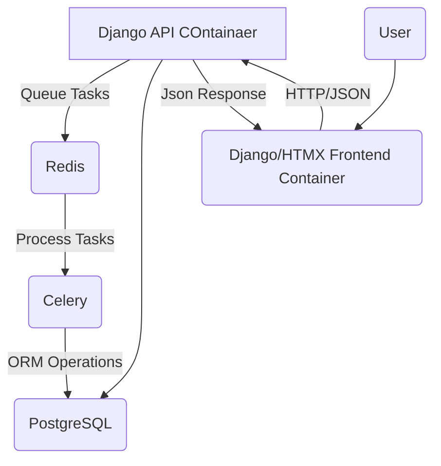

```mermaid

flowchart TD
    A[Django API COntainaer] -->|Queue Tasks| B(Redis)
    B --> |Process Tasks| C(Celery)
    C -->|ORM Operations| D(PostgreSQL)
    A[Django API COntainaer] --> D(PostgreSQL)

    A[Django API COntainaer] --> |Json Response| E(Django/HTMX Frontend Container)
    E(Django/HTMX Frontend Container) --> |HTTP/JSON| A

    F(User) --> E(Django/HTMX Frontend Container)
```
